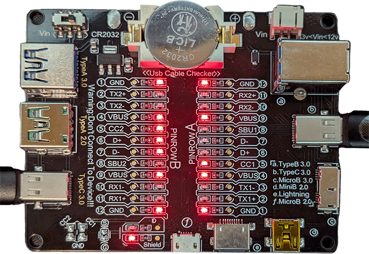
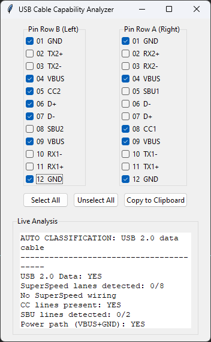

# USB Cable Capability Analyzer

A GUI tool to analyze USB-C cable wiring and capabilities based on pin connections.

## Description

This tool mimics a physical USB-C cable checker board. Users select which pins are active (LEDs ON), and the software infers the cable's wiring, capabilities, and auto-classifies it.

**Note:** This is a diagnostic tool, not a USB-IF compliance certifier.

## Features

- Real-time analysis as you interact with checkboxes.
- Supports USB 2.0, SuperSpeed (USB 3.x), CC lines, SBU lines, power.
- Auto-classification of cable type (e.g., charge-only, USB 2.0 data, full-featured USB-C).
- Select All / Unselect All buttons for quick pin selection.
- Copy report to clipboard button.
- Tooltips on checkboxes explaining each pin's function.
- Word-wrapped, selectable, and copyable analysis output.

## Installation

1. Clone the repository:
   ```
   git clone https://github.com/yourusername/USB_Tool.git
   cd USB_Tool
   ```

2. Ensure Python 3.6+ is installed (Tkinter is included in standard Python installations).

3. (Optional) Create a virtual environment:
   ```
   python -m venv .venv
   .venv\Scripts\activate  # On Windows
   ```

4. Run the application:

   - **Directly with Python:**
     ```
     python usb_cable_tool.py
     ```

   - **On Linux/macOS:**
     ```
     chmod +x run.sh  # Run this only once to make the script executable
     ./run.sh
     ```

   - **On Windows (Batch):**
     ```
     run.bat
     ```

   - **On Windows (PowerShell):**
     ```
     .\run.ps1
     ```

## Usage

- Launch the GUI.
- Check the boxes corresponding to the pins that are active (LEDs ON) on your USB-C cable checker board.
- The analysis updates in real-time below the checkboxes.
- Use "Select All" to check all pins, "Unselect All" to clear them.
- Click "Copy to Clipboard" to copy the full report.
- Hover over checkboxes for tooltips explaining each pin.

## Requirements

- Python 3.6 or higher
- Tkinter (included with Python)

## Screenshots

### Analyzer Board


### Program Screenshot


## Contributing

Feel free to submit issues or pull requests.

## License

MIT License