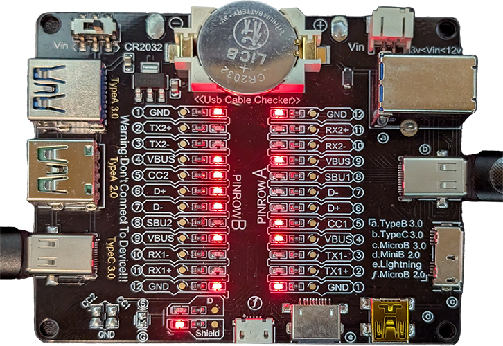
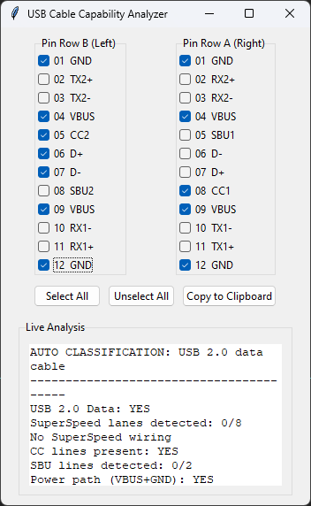

# USB Cable Capability Analyzer



A GUI tool to analyze USB-C cable wiring and capabilities based on pin connections.

## Description

This tool mimics the Treedix C-TRX5-0575 / Occkic MRB063A / Noname USB Cable Tester board. Users select which pins are active (LEDs ON), choose the connector types on each end of the cable, and the software infers the cable's wiring, capabilities, and auto-classifies it.

**Note:** This is a diagnostic tool, not a USB-IF compliance certifier.

## Features

- **Real-time Analysis**: Live diagnostic updates as you interact with checkboxes or change connector selections.
- **Connector Selectors**: Choose the connector type for each cable end (Left: Type A 2.0 / 3.0, Type C 3.0; Right: Type B 3.0, Type C 3.0, Micro B 3.0, Mini B 2.0, Lightning, Micro B 2.0). The analysis adapts based on your selections.
- **Comprehensive Cable Support**: Analyzes USB 2.0, SuperSpeed (USB 3.x), CC lines, SBU lines, and power delivery across multiple connector types.
- **Right-Side Pin Translation**: Automatically maps physical board silk-screen labels (Right Row A) to logical USB signal names for accurate analysis.
- **Broken Pair Detection**: Explicitly identifies incomplete differential pairs (e.g., TX1+ without TX1-) and reports them as potential cable damage.
- **Incomplete Power Wiring Detection**: Detects missing VBUS or GND connections and reports them as damage.
- **Type-C Aware Continuity Rules**: Treats USB-C to USB-C CC continuity differently from USB-C to legacy cables, where CC termination/e-marker behavior is not verified by this continuity board.
- **Extra Diagnostics**: Reports optional ID/OTG and Shield/Shell continuity separately from core cable capability classification.
- **Mismatch Detection**: Flags inconsistencies between selected connector types and detected SuperSpeed wiring.
- **Wiring Warnings**: Distinguishes between critical broken pairs (damage) and non-critical advisories (e.g., missing CC on USB-C continuity checks or unexpected ID/OTG continuity).
- **Lane-Level Reporting**: Independent status for each SuperSpeed lane (Lane 1 & Lane 2) with specific pin counts.
- **Detailed Diagnostics**:
  - Complete lane status (OK / INCOMPLETE / MISSING)
  - Broken differential pair identification
  - Wiring warnings for non-critical issues
  - Orientation-dependent operation warnings
  - Connector configuration summary
  - Checked pin listing per side
- **Auto-Classification**: Smart cable type identification with specific labels:
  - Premium USB-C Cable (Full Featured)
  - USB 3.x Fast Data Cable
  - USB 3.x Data Cable (Single-Lane)
  - USB 2.0 Data Cable (legacy or generic)
  - Charging Cable
  - Charging Cable (Incomplete Power Wiring)
  - NON-STANDARD Cable (incomplete SuperSpeed)
  - DAMAGED CABLE (broken wiring detected)
  - Mismatch (connector vs wiring)
  - Unknown Cable
- **Convenient Controls**: Select All / Unselect All buttons and Copy to Clipboard functionality.
- **User-Friendly UI**: Tooltips on all pin checkboxes explaining each pin's function.

## Installation

1. Clone the repository:
   ```
   git clone https://github.com/aroslanov/USB_Cable_Capability_Analyzer
   cd USB_Cable_Capability_Analyzer
   ```

2. Ensure Python 3.6+ is installed (Tkinter is included in standard Python installations).

3. (Optional) Create a virtual environment:
   ```
   python -m venv .venv
   .venv\Scripts\activate  # On Windows
   ```

4. Run the application:

   - **Directly with Python:**
     ```
     python usb_cable_tool.py
     ```

   - **On Linux/macOS:**
     ```
     chmod +x run.sh  # Run this only once to make the script executable
     ./run.sh
     ```

   - **On Windows (Batch):**
     ```
     run.bat
     ```

   - **On Windows (PowerShell):**
     ```
     .\run.ps1
     ```

## Windows Release (Standalone EXE)

A prebuilt Windows 64-bit standalone EXE is available from the project's GitHub Releases. The release includes a single-file, windowed (no-console) executable: `usb_cable_tool.exe`.

- **Releases page:** https://github.com/aroslanov/USB_Cable_Capability_Analyzer/releases
- **Direct download (v0.1.0):** https://github.com/aroslanov/USB_Cable_Capability_Analyzer/releases/download/v0.1.0/usb_cable_tool.exe

After downloading, run the EXE by double-clicking it or from PowerShell (detached):

```powershell
Start-Process -FilePath .\usb_cable_tool.exe -ArgumentList '--help'
```

Notes:
- The EXE is built for Windows 64-bit and does not require a local Python installation.
- If you don't see the EXE on the release page, open the release and expand the **Assets** section to download the file.
- We recommend verifying the SHA256 checksum provided in the release notes before running the binary.


## Usage

- Launch the GUI.
- Select the connector types for the **Left** and **Right** ends of the cable using the radio button panels.
- Check the boxes corresponding to the pins that are active (LEDs ON) on your USB Cable Tester board.
- Use the **Extra Diagnostics** checkboxes for optional ID/OTG and Shield/Shell continuity indicators when present on the tester.
- The analysis updates in real-time below the checkboxes.
- Use "Select All" to check all pins, "Unselect All" to clear them.
- Click "Copy to Clipboard" to copy the full report.
- Hover over checkboxes for tooltips explaining each pin.

## Analysis Details

### Connector Selection
The left panel offers **Type A 2.0**, **Type A 3.0**, and **Type C 3.0** connectors. The right panel offers **Type B 3.0**, **Type C 3.0**, **Micro B 3.0**, **Mini B 2.0**, **Lightning**, and **Micro B 2.0**. The expected number of SuperSpeed pins and power wiring adjusts based on your selections:
- **USB-C both ends**: Expects 8 SuperSpeed pins, 4× VBUS, 4× GND, CC continuity, and SBU when classifying a full-featured cable.
- **USB-C to legacy USB**: Expects one complete SuperSpeed TX differential pair and one complete SuperSpeed RX differential pair where applicable. CC terminations, pull-ups/pull-downs, and e-marker behavior are not verified by this continuity test.
- **USB 3.0 (non-C)**: Expects 4 SuperSpeed pins: one complete TX differential pair and one complete RX differential pair, plus 1× VBUS and 1× GND.
- **USB 2.0 (non-C)**: Expects no SuperSpeed pins, 1× VBUS, 1× GND.
- **Lightning**: Treated as proprietary USB 2.0-style continuity only; Lightning itself is not a USB-IF connector standard.

### Right-Side Pin Translation
The physical board's Right Row A has a different silk-screen labeling than the logical USB-C standard. The tool automatically translates board labels to logical signals:
| Board Label | Logical Signal |
|-------------|---------------|
| RX2+ (Pin 2) | TX1+ |
| RX2- (Pin 3) | TX1- |
| D- (Pin 6) | D+ |
| D+ (Pin 7) | D- |
| TX1- (Pin 10) | RX2- |
| TX1+ (Pin 11) | RX2+ |

No translation is needed for the Left Row B (pins follow standard labeling).

### Broken Pair Detection
The tool detects incomplete SuperSpeed TX/RX differential pairs, broken USB 2.0 D+/D- pairs, and incomplete power wiring. If any broken pairs are found, the cable is classified as **DAMAGED CABLE** with specific identification.

**Examples**:
- TX1+ present but TX1- missing → "TX1 differential pair broken"
- D+ present but D- missing → "USB 2.0 D+/D- pair broken"
- VBUS present but GND missing → "Power wiring incomplete (VBUS/GND)"

### Wiring Warnings
Non-critical issues are reported as warnings rather than damage:
- Missing CC continuity on a USB-C to USB-C cable
- Incomplete CC continuity on a USB-C to USB-C cable
- USB-C to legacy cables where CC termination/e-marker behavior cannot be verified by continuity alone
- ID/OTG continuity on connector types where an ID pin is not expected
- Lightning is proprietary; the tool only checks exposed USB 2.0-style continuity

### Extra Diagnostics
ID/OTG and Shield/Shell are reported as secondary diagnostics. They do not determine USB speed, charging capability, or the main cable classification.

- **ID/OTG**: Relevant only for Mini/Micro USB OTG-style connectors. ID absent is normal for regular Mini-B/Micro-B device cables; ID present can indicate OTG or host-mode adapter behavior. USB-C does not use ID, so ID on a USB-C selection is reported as an unexpected warning.
- **Shield/Shell**: Reports connector shell or cable shield continuity as present or absent/unknown. Missing shield continuity can reduce EMI/noise protection, but does not by itself make the cable unusable or damaged.

### Lane-Level Reporting
Each SuperSpeed lane is analyzed independently:
- **OK**: All 4 pins present (TX+, TX-, RX+, RX-)
- **INCOMPLETE**: Partial pins detected with count (e.g., 3/4 pins)
- **MISSING**: No pins from that lane detected

### Auto-Classification
The tool automatically classifies cables into categories based on detected wiring and connector selection:
- **Premium USB-C Cable (Full Featured)** — All 8 SuperSpeed pins + USB 2.0 + CC + both SBU lines
- **USB 3.x Fast Data Cable** — Full SuperSpeed (8 pins) + USB 2.0 + CC
- **USB 3.x Data Cable (Single-Lane)** — 4 SuperSpeed pins + USB 2.0
- **USB 2.0 Data Cable** — USB 2.0 data only, no SuperSpeed
- **Charging Cable** — Power only, no data lines
- **Charging Cable (Incomplete Power Wiring)** — Power only but VBUS/GND incomplete
- **NON-STANDARD Cable** — USB 2.0 with incomplete SuperSpeed pins
- **DAMAGED CABLE** — Broken differential pairs or incomplete power detected
- **Mismatch** — Connector selection doesn't match detected wiring
- **Unknown Cable** — Cannot determine cable type

Orientation warnings are provided for single-lane USB-C to legacy operation. A USB-C to USB-C cable with only one complete SuperSpeed lane is reported as non-standard rather than as a valid orientation-dependent cable.

## Running Tests

Unit tests are provided in `tests/test_analyze_cable.py`. Run them with:

```
python -m unittest tests.test_analyze_cable
```

Tests cover:
- All valid connector pair combinations (3 left × 6 right = 18 combinations)
- USB 2.0 legacy (Type A to Micro B)
- USB 3.0 legacy single-lane (Type A 3.0 to Type B 3.0)
- Full-featured USB-C (both ends)
- Missing CC on USB-C (reported as a wiring warning)
- USB-C to Type B (single-lane, with CC continuity not required)
- ID/OTG and Shield/Shell as secondary diagnostics
- Legacy USB 3.0 mixed TX/RX pair labeling from Type-C rows
- Lightning as proprietary USB 2.0-style continuity
- Charge-only legacy cable
- Broken USB 2.0 pair
- SuperSpeed mismatch with connector selection
- Mixed Type-C row SuperSpeed pairs on legacy USB 3.0 connectors
- Incomplete power wiring

## Requirements

- Python 3.6 or higher
- Tkinter (included with Python)
- No external pip dependencies

## Screenshot



## Contributing

Feel free to submit issues or pull requests.

## License

MIT License
